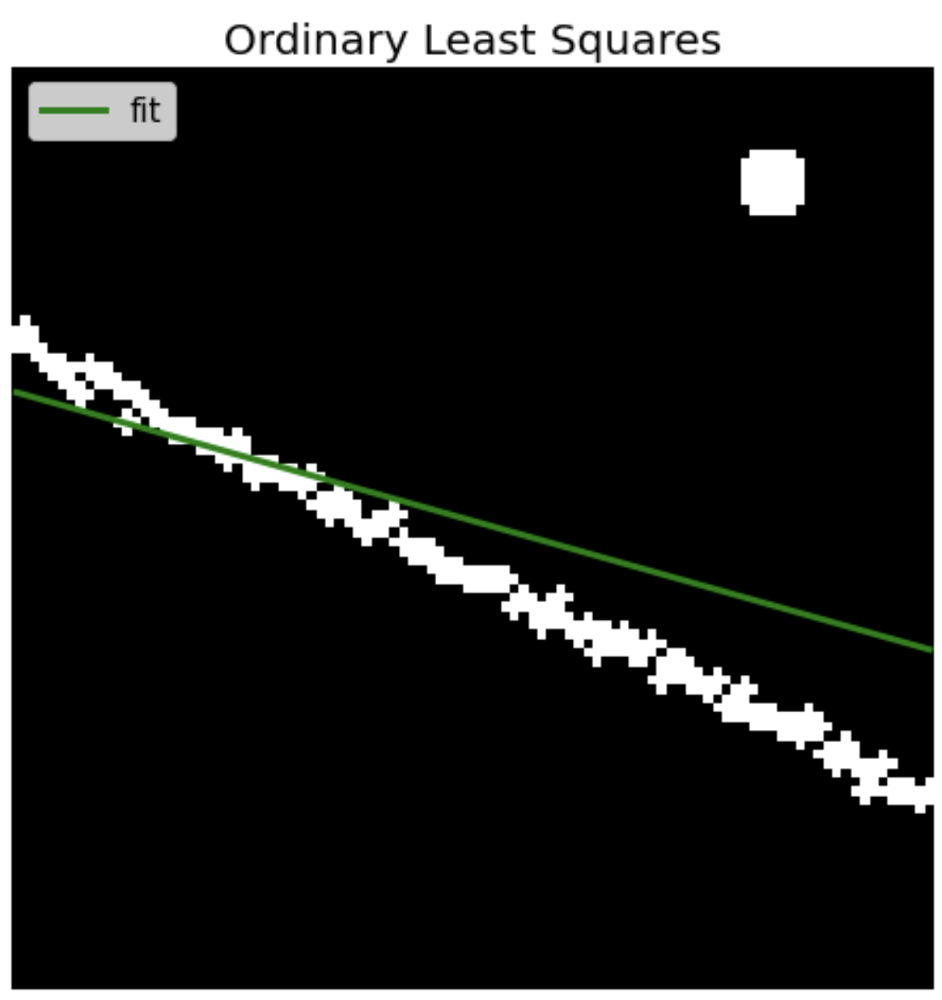
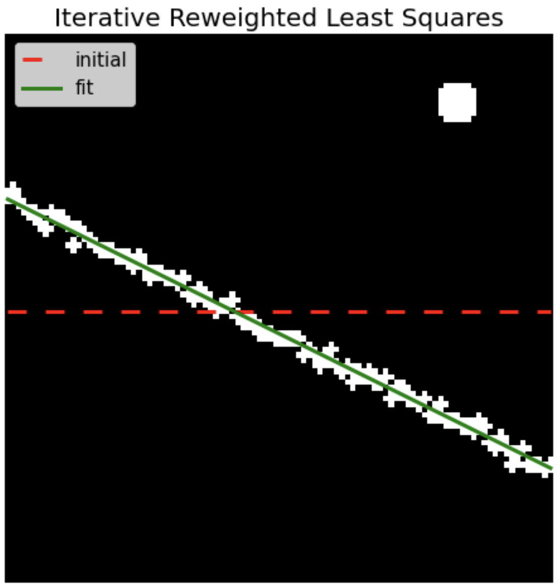
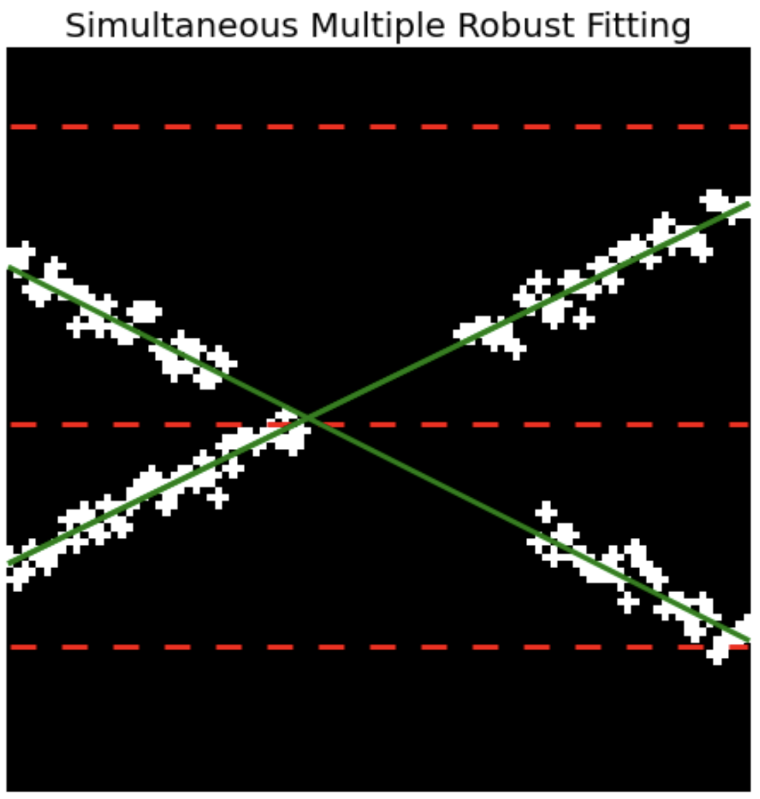

# Simultaneous-Multiple-Robust-Fitting
Python implementation of Tarel et al. IRLS and SMRF algorithms for robust multi-curve reconstruction from noisy images for computer vision applications

### Backgroud
Curve reconstruction is a common problem in computer vision applications where after a preliminary segmentation task, which is designed to obtain a binary mask of curve pixels, a mathematical representation of the curve is extracted for further analytics. In the best case scenario the segmentation mask is accurate, and curve reconstruction is needed only to characterize the shape of the profile. However, most commonly the segmentation mask is partially interrupted, noisy, or formed of different instances. In all these cases curve reconstruction is a useful post-processing step which allows to increase the quality of segmentation, and to discriminate different instances.

### Iterative Robust Least Squares
Ordinary Least Squares (OLS) relies on a Gaussian model to represent noise, which prevents its application in case of more complex noise generation processes and outliers, as shown below 
<p align="center">
  
</p>

To overcome this problem alternative noise models with heavier tails than the Gaussian can be used. This leads to an iterative solution of the curve optimization problem, such as the Iterative Robust Least Squares method [1]. Since the solution is iterative it is necessary to specify an initial guess for the parameters `A_init`.
```
# Example - IRLS
from curve_reconstruction.linear_model import LinearModel
from curve_reconstruction.irls import IRLS

noise_model = 'cauchy'    # noise function
scale = 5                 # noise intensity
A_init = [50, 0]          # initial parameters

# Optimal parameters estimation
A_irls = IRLS(X_im,y_im,A_init,noise_model,scale)

# Curve reconstruction
model_irls = LinearModel('line', [A_irls])
y_irls = model_irls.predict(x)
```
<p align="center">
  
</p>

See `notebooks` for more details.

### Simultaneous Multiple Robust Fitting
Simultaneous Multiple Robust Fitting (SMRF) [2] find simulatenously the optimal parameters of multiple curves iteratively. One of the major advantages of this method is that it is not necessary to know a priori the number of curves to fit. In the example below parameters of 3 horizontal lines are use to fit 2 curves in the mask. Overlapping curves can be easily removed by evaluating the similarity of the parameters.
```
# Example - SMRF
from curve_reconstruction.linear_model import LinearModel
from curve_reconstruction.smrf import SMRF

# Initial parameters
A_init = np.array([
    [10, 0],               # curve 1 
    [50, 0],               # curve 2 
    [80, 0]])              # curve 3
noise_model = 'cauchy'     # noise function 
scale = 5                  # noise intensity

# Optimal parameters estimation
A_smrf = SMRF(X_im,y_im,A_init,noise_model,scale)

# Curve reconstruction
model_smrf = LinearModel('line', A_smrf)
Y_smrf = model_smrf.predict(x)
```
<p align="center">
  
</p>
See `notebooks` for more details.

### References
[1] Tarel et al. Using Robust Estimation Algorithms for Tracking Explicit Curves. Computer Vision — ECCV 2002 

[2] Tarel et al. Simultaneous robust fitting of multiple curves. VISAPP 2007
